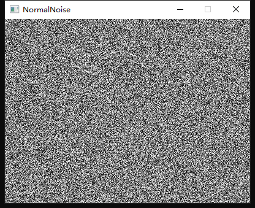
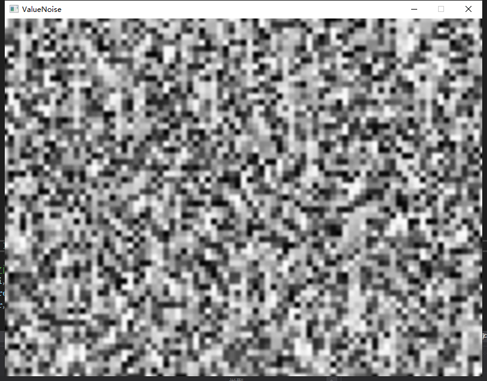
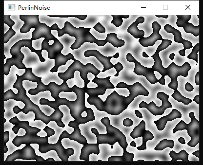

# 噪声

## 一、噪声种类
最近一段时间开始研究沙盒游戏中地图生成是如何处理的，看到了这个叫做 `柏林噪声` 的函数，于是乎打算用 `SDL` 来实现并学习一下，顺带整理个 Blog 水一发绿墙（×）。

参考文章：[游戏开发中的噪声算法](https://www.cnblogs.com/KillerAery/p/10765897.html#%E5%8F%AF%E5%B9%B3%E9%93%BA%E7%9A%84%E5%99%AA%E5%A3%B0)、[Minecraft类游戏地形生成机制](https://www.cnblogs.com/KillerAery/p/11509470.html)

柏林噪声的核心是一个柏林噪声的函数，该函数以坐标向量作为参数，得到一个 `噪声值（值域为 [-1, 1]）` 作为结果，主要用于程序中生成随机的而有规律的内容，比如说游戏地图。

首先，让我们看向这个完全随机的噪声图像，它使用 `rand()` 函数随机生成一个点的颜色值，然后将他们显示出来。

```C++
#include <iostream>
#include <cstdlib>
#include <time.h>
#include <SDL.h>
using namespace std;

static constexpr int WINDOW_WIDTH  = 400;
static constexpr int WINDOW_HEIGHT = 300;
static constexpr int FRAME_AMOUNT  = 30;

#undef main
int main()
{
	// 初始化 SDL
	SDL_Init(SDL_INIT_EVERYTHING);
	SDL_Window* pWindow =
		SDL_CreateWindow("NormalNoise", SDL_WINDOWPOS_UNDEFINED, SDL_WINDOWPOS_UNDEFINED, WINDOW_WIDTH, WINDOW_HEIGHT, SDL_WINDOW_SHOWN);
	SDL_Renderer* pRenderer =
		SDL_CreateRenderer(pWindow, -1, SDL_RENDERER_ACCELERATED);
	SDL_SetRenderDrawBlendMode(pRenderer, SDL_BLENDMODE_BLEND);
	SDL_SetHint(SDL_HINT_RENDER_SCALE_QUALITY, "best");

	// 初始化随机数产生器种子
	srand((unsigned int)time(NULL));

	bool isQuit = false;
	SDL_Event theEvent;
	while (!isQuit)
	{
		Uint32 theFrameStart = SDL_GetTicks();
		SDL_RenderClear(pRenderer);

		// 接受 SDL 事件
		while (SDL_PollEvent(&theEvent))
		{
			switch (theEvent.type)
			{
			case SDL_QUIT:
				isQuit = true;
				break;
			default:
				break;
			}
		}

		// 完全随机地输出一个噪声图像
		for (int i = 0; i < WINDOW_WIDTH; i++)
			for (int j = 0; j < WINDOW_HEIGHT; j++)
			{
				Uint8 nRandomColor = rand() % 256;
				SDL_SetRenderDrawColor(pRenderer, nRandomColor, nRandomColor, nRandomColor, 255);
				SDL_RenderDrawPoint(pRenderer, i, j);
			}

		Uint32 theFrameEnd = SDL_GetTicks();
		if (theFrameEnd - theFrameStart < 1000 / FRAME_AMOUNT)
			SDL_Delay(1000 / FRAME_AMOUNT - (theFrameEnd - theFrameStart));
		SDL_RenderPresent(pRenderer);
	}

	SDL_DestroyRenderer(pRenderer);
	SDL_DestroyWindow(pWindow);
	SDL_Quit();
	return 0;
}
```

让我们来看看这个程序运行起来的结果：



奥我的上帝，它就像是小时候在大屁股电视机上看到的雪花屏，图像中没有任何规律，而游戏的地图肯定不能是这样的，至少是在符合常识的地图中。

噪声需要满足三个特性：`随机性`、`哈希性`、`平滑性`，

`随机性` 不用多说，我们研究这个算法就是为了这个。

其中，`哈希性` 是希望在相同的种子值输入下，程序每次运行输出的噪声值都一样，这在 `Minecraft` 中动态加载区块有所运用到，游戏会自动卸载远离玩家的区块，加载玩家附近的区块，而我们不希望被卸载掉的区块在下次被加载进来的时候完全不一样了...

而 `平滑性` 要求的是地形连续且自然，毕竟一般情况下我们不希望地形的起伏像噪声波那样处处突变，而使其连续的一般思想就是将地图分为若干个小的单位，然后单位之间的值通过 `插值` 来达到连续的效果。

噪声有 `单噪声` 和 `复合噪声` 的区别之分，复合噪声就是将多个单噪声的结果加在一起，使其能够表现出多个噪声的特性，一般使用 `分形噪声` 的思想，叠加三层振幅和频率各不一样的噪声，使得最终的复合噪声既在宏观上有山地、平原，又在微观上拥有小的坑洼和隆起。

单噪声有基于晶格的 `Value 噪声`、`Perlin 噪声`、`Simplex 噪声` 等，和基于点的 `Worley 噪声`，接下来就看看前三者这几个比较常见的噪声吧。

> 为了让整个过程变的更有意思，我们所有的噪声都是三维的形式，并每帧改变 y 轴上的值，将 xz 平面上的图像打印出来完成动态的效果。

## 二、Value 噪声

最简单的一种噪声，基本思想是将一个图像 `晶格化`，就像高中化学中的晶体结构一样，然后通过哈希运算为每个晶格上的每一个顶点计算出一个随机值 `( Grad()方法 )`，该随机值会影响它周围的坐标的值，且越靠近它的坐标受它的影响越大 `( Fade()方法 )`。这样，地图中的每一个坐标只用累加周围顶点对它的影响值即可得到总值 `( Get() 方法中结尾的三层 Lerp()方法 )`。

```C++
#include <iostream>
#include <cstdlib>
#include <time.h>
#include <SDL.h>
#include <cmath>
using namespace std;

static constexpr int WINDOW_WIDTH = 800;
static constexpr int WINDOW_HEIGHT = 600;
static constexpr int FRAME_AMOUNT = 30;

class ValueNoise
{
public:
	ValueNoise(unsigned int seed = 1) {
		srand(seed);
		mP = new int[512];
		for (int i = 0; i < 256; i++)
			mP[256 + i] = mP[i] = rand() & 255;
	}
	~ValueNoise() { delete[] mP; }

	double Get(double x, double y, double z)
	{
		// 计算所在晶格坐标并取余 256，用于计算获得顶点哈希值
		// 从而根据顶点哈希值在 Grad() 函数中伪随机选择顶点噪声值
		int x_ = (int)floor(x) & 255;
		int y_ = (int)floor(y) & 255;
		int z_ = (int)floor(z) & 255;
		// 算出三个坐标在晶格中的坐标
		x -= floor(x);
		y -= floor(y);
		z -= floor(z);
		// 用缓冲函数缓冲三个坐标作为权值，使过渡更加自然
		double u = Fade(x);
		double v = Fade(y);
		double w = Fade(z);
		// 计算该点所在晶格中八个顶点上的值对它的贡献
		int a = mP[x_] + y_; int aa = mP[a] + z_; int ab = mP[a + 1] + z_;
		int b = mP[x_ + 1] + y_; int ba = mP[b] + z_; int bb = mP[b + 1] + z_;
		return Lerp(w,
			Lerp(v, Lerp(u, Grad(mP[aa]), Grad(mP[ba])),
				Lerp(u, Grad(mP[ab]), Grad(mP[bb]))),
			Lerp(v, Lerp(u, Grad(mP[aa + 1]), Grad(mP[ba + 1])),
				Lerp(u, Grad(mP[ab + 1]), Grad(mP[bb + 1])))
		);
	}

private:
	// 根据哈希值选择伪随机梯度向量，并计算出点乘结果
	double Grad(int hash)
	{
		return hash / 255.0;
	}
	// 缓冲函数
	double Fade(double t)
	{
		return t * t * t * (t * (t * 6 - 15) + 10);
	}
	// 计算两顶点对其连成的直线上的点的影响
	double Lerp(double weight, double a, double b)
	{
		return a + weight * (b - a);
	}
	int* mP = nullptr;
};

#undef main
int main()
{
	// 初始化 SDL
	SDL_Init(SDL_INIT_EVERYTHING);
	SDL_Window* pWindow =
		SDL_CreateWindow("ValueNoise", SDL_WINDOWPOS_UNDEFINED, SDL_WINDOWPOS_UNDEFINED, WINDOW_WIDTH, WINDOW_HEIGHT, SDL_WINDOW_SHOWN);
	SDL_Renderer* pRenderer =
		SDL_CreateRenderer(pWindow, -1, SDL_RENDERER_ACCELERATED);
	SDL_SetRenderDrawBlendMode(pRenderer, SDL_BLENDMODE_BLEND);
	SDL_SetHint(SDL_HINT_RENDER_SCALE_QUALITY, "best");

	bool isQuit = false;
	SDL_Event theEvent;
	ValueNoise test(114);
	double k = 0.0;

	while (!isQuit)
	{
		int theFrameStart = SDL_GetTicks();
		k += 0.1;
		SDL_RenderClear(pRenderer);
		while (SDL_PollEvent(&theEvent))
		{
			switch (theEvent.type)
			{
			case SDL_QUIT:
				isQuit = true;
				break;
			}
		}

		for (double i = 0; i < 80; i += 0.1)
			for (double j = 0; j < 60; j += 0.1)
			{
				// 最后返回的值在 0.0 ~ 1.0 之间，我们只需做好映射即可
				int nCurrentColor = test.Get(i, j, k) * 255.0;
				SDL_SetRenderDrawColor(pRenderer, nCurrentColor, nCurrentColor, nCurrentColor, 255);
				SDL_RenderDrawPointF(pRenderer, i * 10.0, j * 10.0);
			}

		int theFrameEnd = SDL_GetTicks();
		if (theFrameEnd - theFrameStart < 1000 / FRAME_AMOUNT)
			SDL_Delay(1000 / FRAME_AMOUNT - (theFrameEnd - theFrameStart));

		SDL_RenderPresent(pRenderer);
	}
	
	SDL_DestroyRenderer(pRenderer);
	SDL_DestroyWindow(pWindow);
	SDL_Quit();
	return 0;
}
```

当你尝试运行这个程序的时候，你会得到如下的结果：



看起来有规律多了不是吗，你可以使 `p数组` 中的数遵守一定的规律，从而使你的图像拥有大体上相似的趋势，而这个图像的 `p数组` 都是 `rand()` 中产生的伪随机数，所以看上去也很随机。


## 三、Perlin 噪声

最最最最最著名的噪声，Perlin 噪声！Perlin 噪声是常用的噪声之一。

和 Value 噪声不一样的地方是，Perlin 噪声的每个顶点上是一个伪随机的梯度向量，晶格中的每个点需要计算 `从它指向周围顶点的向量` 点乘对应顶点上 `梯度向量` 的值，然后再根据每个顶点到它的距离算出每个顶点对这个点 `噪声值` 的贡献，接下来就请看看这个程序吧。

```C++
#include <iostream>
#include <cstdlib>
#include <time.h>
#include <SDL.h>
#include <cmath>
using namespace std;

static constexpr int WINDOW_WIDTH  = 400;
static constexpr int WINDOW_HEIGHT = 300;
static constexpr int FRAME_AMOUNT =  30;

// 肯·柏林在 2002 年写下的伪随机值
static int p[256] = {
	151,160,137,91,90,15,
	131,13,201,95,96,53,194,233,7,225,140,36,103,30,69,142,8,99,37,240,21,10,23,
	190, 6,148,247,120,234,75,0,26,197,62,94,252,219,203,117,35,11,32,57,177,33,
	88,237,149,56,87,174,20,125,136,171,168, 68,175,74,165,71,134,139,48,27,166,
	77,146,158,231,83,111,229,122,60,211,133,230,220,105,92,41,55,46,245,40,244,
	102,143,54, 65,25,63,161, 1,216,80,73,209,76,132,187,208, 89,18,169,200,196,
	135,130,116,188,159,86,164,100,109,198,173,186, 3,64,52,217,226,250,124,123,
	5,202,38,147,118,126,255,82,85,212,207,206,59,227,47,16,58,17,182,189,28,42,
	223,183,170,213,119,248,152, 2,44,154,163, 70,221,153,101,155,167, 43,172,9,
	129,22,39,253, 19,98,108,110,79,113,224,232,178,185, 112,104,218,246,97,228,
	251,34,242,193,238,210,144,12,191,179,162,241, 81,51,145,235,249,14,239,107,
	49,192,214, 31,181,199,106,157,184, 84,204,176,115,121,50,45,127, 4,150,254,
	138,236,205,93,222,114,67,29,24,72,243,141,128,195,78,66,215,61,156,180
};

class PerlinNoise
{
public:
	PerlinNoise() {
		mP = new int[512];
		for (int i = 0; i < 256; i++)
			mP[256 + i] = mP[i] = p[i];
	}
	~PerlinNoise() { delete[] mP; }

	double Get(double x, double y, double z)
	{
		// 计算所在晶格坐标并取余 256，用于计算获得顶点哈希值
		// 从而根据顶点哈希值在 Grad() 函数中伪随机选择梯度向量
		int x_ = (int)floor(x) & 255;
		int y_ = (int)floor(y) & 255;
		int z_ = (int)floor(z) & 255;
		// 计算三维坐标值的小数部分
		// 后续用于计算出从该点到八个顶点的向量
		x -= (int)floor(x);
		y -= (int)floor(y);
		z -= (int)floor(z);
		// 用缓冲函数缓冲三个坐标作为权值，使过渡更加自然
		double u = Fade(x);
		double v = Fade(y);
		double w = Fade(z);
		// 计算该点所在晶格中八个顶点上的梯度向量对它的影响
		int a = mP[x_] + y_; int aa = mP[a] + z_; int ab = mP[a + 1] + z_;
		int b = mP[x_ + 1] + y_; int ba = mP[b] + z_; int bb = mP[b + 1] + z_;
		return Lerp(w,
			Lerp(v, Lerp(u, Grad(mP[aa], x, y, z), Grad(mP[ba], x - 1, y, z)),
				Lerp(u, Grad(mP[ab], x, y - 1, z), Grad(mP[bb], x - 1, y - 1, z))),
			Lerp(v, Lerp(u, Grad(mP[aa + 1], x, y, z - 1), Grad(mP[ba + 1], x - 1, y, z - 1)),
				Lerp(u, Grad(mP[ab + 1], x, y - 1, z - 1), Grad(mP[bb + 1], x - 1, y - 1, z - 1)))
		);
	}

private:
	// 根据哈希值选择伪随机梯度向量，并计算出点乘结果
	double Grad(int hash, double x, double y, double z)
	{
		int h = hash & 15;
		double u = h < 8 ? x : y,
			v = h < 4 ? y : h == 12 || h == 14 ? x : z;
		return ((h & 1) == 0 ? u : -u) + ((h & 2) == 0 ? v : -v);
	}
	// 缓冲函数
	double Fade(double t)
	{
		return t * t * t * (t * (t * 6 - 15) + 10);
	}
	// 计算两顶点对其连成的直线上的点的影响
	double Lerp(double weight, double a, double b)
	{
		return a + weight * (b - a);
	}
	int* mP = nullptr;
};

#undef main
int main()
{
	// 初始化 SDL
	SDL_Init(SDL_INIT_EVERYTHING);
	SDL_Window* pWindow =
		SDL_CreateWindow("PerlinNoise", SDL_WINDOWPOS_UNDEFINED, SDL_WINDOWPOS_UNDEFINED, WINDOW_WIDTH, WINDOW_HEIGHT, SDL_WINDOW_SHOWN);
	SDL_Renderer* pRenderer =
		SDL_CreateRenderer(pWindow, -1, SDL_RENDERER_ACCELERATED);
	SDL_SetRenderDrawBlendMode(pRenderer, SDL_BLENDMODE_BLEND);
	SDL_SetHint(SDL_HINT_RENDER_SCALE_QUALITY, "best");

	bool isQuit = false;
	double k = 0.0;
	SDL_Event theEvent;
	PerlinNoise test;

	while (!isQuit)
	{
		int theFrameStart = SDL_GetTicks();

		SDL_RenderClear(pRenderer);

		k += 0.1;
		while (SDL_PollEvent(&theEvent))
		{
			switch (theEvent.type)
			{
			case SDL_QUIT:
				isQuit = true;
				break;
			}
		}

		for (double i = 0; i < 20; i += 0.05)
			for (double j = 0; j < 15; j += 0.05)
			{
				// 最后返回的值在 -1.0 ~ 1.0 之间，我们只需做好映射即可
				int nCurrentColor = test.Get(i, j, k) * 255.0;
				SDL_SetRenderDrawColor(pRenderer, nCurrentColor, nCurrentColor, nCurrentColor, 255);
				SDL_RenderDrawPointF(pRenderer, i * 20.0, j * 20.0);
			}

		int theFrameEnd = SDL_GetTicks();
		if (theFrameEnd - theFrameStart < 1000 / FRAME_AMOUNT)
			SDL_Delay(1000 / FRAME_AMOUNT - (theFrameEnd - theFrameStart));

		SDL_RenderPresent(pRenderer);
	}

	SDL_DestroyRenderer(pRenderer);
	SDL_DestroyWindow(pWindow);
	SDL_Quit();
	return 0;
}
```

如果你尝试运行这个程序，你便会看到密集恐惧者福利（？），大小不一的坑洞随着时间流逝蠕动着，这是因为上述程序写的是一个三维的柏林函数，而控制第三个维度的 k 值在不断增加，于是乎你看到的就是三维到二维的一个切片...



通过改变 `p数组` 伪随机数表，我们便可以得到不一样的效果，如果伪随机数表一样则地图也一样，这便可以当做地图种子来使用。

通过改变 `Grad函数` 根据哈希值返回的向量，我们可以控制整个柏林噪声的大体趋势，从而得出我们想要的柏林噪声。

## 四、Simplex 噪声

Simplex 噪声是对 Perlin 噪声的一种改进，它在高维上可以表现出非常明显的优势，因为它选取的晶格是 `单形(Simplex)`，其需要计算的顶点数也随之减少。在 n 维下，Perlin噪声的时间复杂度为 `O(2^n)`，而 Simplex 噪声的时间复杂度为 `O(n^2)`。

等到下一次需要用到这个噪声的时候再补充这部分笔记吧（

> --by hsz 2021.12.22