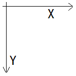
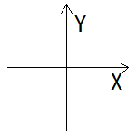
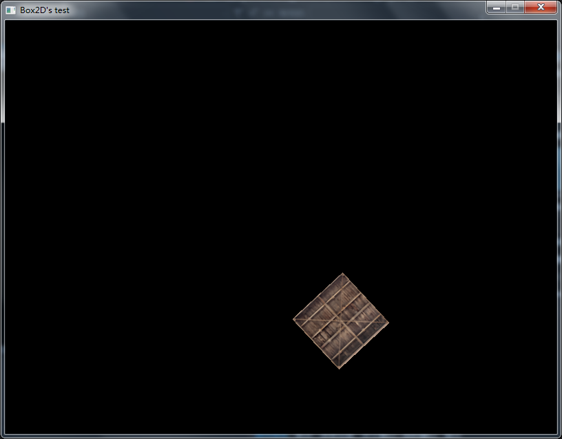

# Hello, Box2D !

这一篇，我会用 `SDL` 将 Box2D 官网上的示例程序给渲染出来。

值得一提的是，Box2D 中的 `testbed` 使用 `OpenGL` 来渲染图像，且使用 `ImGUI` 作为其 GUI 库，这对经典的组合让我感到无比的亲切（笑）。

再顺带一提，Box2D 的 JSON 解析库使用的是 `sajson`，它通过这个解析库保存 testbed 的菜单配置。

那么废话不多说了，接下来就开始尝试写出这个程序吧。

# 创建一个世界

前面一篇我们提到过，Box2D 使用自己实现的内存池来管理对象。这些对象的内存管理由 `世界 (b2World)` 来完成，世界是管理内存、对象和模拟的中心，所以我们无论干什么之前我们都需要先创建一个世界。

```C++
// 定义重力向量
b2Vec2 gravity(0.0f, -10.0f);
// 创建世界
b2World world(gravity);
```

世界便创建好了，接下来我们需要创建两个刚体，先是第一个作为地板的静态刚体。

# 创建一个静态刚体

```C++
// 创建刚体的定义
b2BodyDef groundBodyDef;
// 设置该静态刚体定义的位置属性
groundBodyDef.position.Set(40.0f, -30.0f);
// 调用世界的工厂函数构造该对象
b2Body* groundBody = world.CreateBody(&groundBodyDef);
```

可以看到，最后一行中 `b2World::CreateBody` 方法便是一个工厂函数，我们在创建一个刚体对象前，需要先创建刚体的 `定义`，然后把 `定义` 传给工厂函数，工厂函数根据定义的信息来构建该对象。

这就很像我们去餐馆里点菜，服务员先记下我们点的所有菜，然后将该订单传给后厨，后厨根据这张订单烹饪出我们想要的菜肴。你肯定不能用别的方法来创建这些对象，就好像你肯定不会跑到别人餐馆里另起炉灶（笑）。

但这里的刚体还没有 `形状 (b2Shape)`，我们需要用 `夹具 (b2Fixture)` 把形状给"夹"到刚体上去。

```C++
// 创建一个形状
b2PolygonShape groundBox;
groundBox.SetAsBox(40.0f, 5.0f);
// 调用刚体的工厂函数构造该夹具
groundBody->CreateFixture(&groundBox, 0.0f);
```

你有可能想问，为什么形状不需要调用工厂函数来创建呢？因为形状只是我们构造夹具时所需要的信息而已，我们并不需要保存信息的引用，这就好像厨师只需要在烹饪的时候知道你想要什么便好（笑）。

但在这里我们稍微偷了个懒，我们并没有像刚才创建刚体对象的时候一样，先创建一个定义，再将定义传给工厂函数让其去构造，我们在这里是直接把 `形状` 和 `密度` 传给了工厂函数让其去构造夹具。但这并不重要，毕竟最后都是将构造夹具所需的信息传给了工厂函数。

按照定义来说，静态刚体的质量为零，我们将其密度设置为零便好，毕竟我们不需要知道一个不会发生碰撞的对象的质量。

如此，一个可以作为地板的静态刚体便出现在了 Box2D 的世界中，它长达 80m，高达 10m，`因为传递给 b2PolygonShape::SetAsBox 方法的参数是矩形盒长宽的一半`，
而且 Box2D 采用的是 `MKS 单位制`。

当这个刚体的位置改变或者角度旋转的时候，形状上的每一点也会跟着它移动或旋转，因为形状上的每一点都将该刚体的坐标当做原点。

这里有一个奇怪的问题，我们可以在模拟过程修改形状 `相对于刚体` 的位置和角度吗？这样是不行的，那些修改相当于形状发生了改变，而 Box2D 是一个模拟形状不会发生改变的物体的物理引擎。

接下来，让我们创建一个会动的刚体吧。

# 创建一个动态刚体

让我们先贴出这部分代码：

```C++
b2BodyDef bodyDef;
bodyDef.type = b2_dynamicBody;
bodyDef.position.Set(40.0f, 10.0f);
bodyDef.angle = (b2_pi / 6.0f);
b2Body* body = world.CreateBody(&bodyDef);
```

由于刚体默认是静态的，所以我们在创建定义时需要手动设置为动态，也就是将 type 赋值为 b2_dynamicBody，这一步是必须的。

其次，由于我们想让刚体倾斜一定角度掉落在地面上，所以我们除了设置了位置以外，还设置了角度，由于 Box2D 使用的是 `弧度制`，所以我们用 `b2_pi`，也就是圆周率来设置好该角度。

最后调用工厂函数，一个动态刚体便创建完毕了，接下来像刚才一样创建形状并构造夹具即可，这里我们用夹具的定义来构造。

```C++
b2PolygonShape dynamicBox;
dynamicBox.SetAsBox(5.0f, 5.0f);    // 这个包围盒长 10m, 宽 10m

b2FixtureDef fixtureDef;
fixtureDef.shape = &dynamicBox;     // 夹具对象在构造时，会复制这份形状来使用
fixtureDef.density = 1.0f;          // 密度，这里我们设置为 1.0 kg/m³
fixtureDef.friction = 0.5f;         // 摩擦系数
fixtureDef.restitution = 0.5f;      // 恢复系数，在这里表现为弹性
body->CreateFixture(&fixtureDef);
```

为刚体构造这些夹具时，Box2D 会自动帮你算出刚体的质量，刚体中至少有一个夹具的密度不为零，否则你会看到一些很奇怪的效果。

接下来，让我们开始模拟这个物理世界并用 `SDL` 输出画面吧。

# 模拟世界

首先我们知道，一个游戏是一帧一帧运行起来的，所以 Box2D 这个物理引擎给我们提供了一个步进的方法，即 `b2World::Step` 方法，让我们来看看这个函数的原型：

```C++
void b2World::Step(
    float 	timeStep,
    int32 	velocityIterations,
    int32   positionIterations 
)	
```

timeStep 很显然就是我们需要步进的时间；

velocityIterations 即 `速度迭代次数`；

positionIterations 即 `位置迭代次数`。

看到这里便能知道，Box2D 有一个算法会在 `离散` 的时间点上计算物理方程来完成模拟，我们称其为 `积分器 (integrator)`，我们得告诉它我们需要步进的时间长短。由于一般的游戏都是 60 帧，所以在这里我们步进 `1.0f / 60.0f` 秒获得 60 帧的效果，当然你也可以设置更小的值，譬如 `1.0f / 144.0f` 秒。

`Box2D 不希望这个步进的时间长短在模拟过程中发生改变`，你有可能会想把实际帧率作为参数传进去，以防止游戏运行速率因为单帧计算量过大而变慢（游戏速率变慢的现象在红警等比较老的游戏中很常见），但这样会直接导致我们模拟的物理世界行为不确定。

这是因为实际帧率是不稳定的，程序运行时每次传入的步进时间参数也就不一样，所以在某些情况下程序模拟出来的效果可能每次都不一样。

除了积分器，Box2D 还有用于计算约束的 `约束解算器 (constraint solver)`， 而后面两个参数就与它有关。抛开前面讲的关于约束的抽象概念，`约束求解` 的过程实际上就是修正两个刚体之间的关系。

譬如两个刚体在运动的时候重叠在了一起，约束解算器就会改变它俩的位置，减小它们的重叠面积；两个由关节连接在一起的刚体旋转时超过了关节的限制，约束解算器就会将刚体的角度修改到关节限制的角度内。

如果只是两个刚体的话，那么一次约束求解便可以很好地完成工作。可是当两个以上的刚体互相作用时，求解一对刚体的约束会对另一对刚体的约束产生轻微的影响，我们便需要多次迭代，于是乎出现了 `迭代次数` 的概念。

在这里请记住，不管迭代几次，我们都是在一帧（你给定的步进时间长度）内完成的这些操作。

约束求解的过程分为两步，便是我们上面提到的 `速度迭代` 和 `位置迭代`。首先，`速度迭代` 计算刚体所受的所有力，让刚体朝着正确的方向运动；其次，`位置迭代` 再负责减少刚体之间的重叠面积、限制关节的脱离。后者有可能提前退出如果那些差错本身就比较小的话。

官方推荐的迭代次数是速度迭代 8 次，位置迭代 3 次，这需要你自己去权衡一下质量和效率。说完这些，我们写下这些代码：

```C++
// 游戏循坏外
bool isQuit = false;
float timeStep = 1.0f / 60.0f;
int velocityIterations = 8;
int positionIterations = 3;
// ...

// 游戏循环内
while(isQuit)
{
    //...
    world.Step(timeStep, velocityIterations, positionIterations);
    //...
}
```

这样，我们便成功地模拟了这个物理世界，接下来需要做的是输出这些画面。

# 输出画面

我们使用 SDL 来输出画面，可是这里出现了一个问题，SDL 以窗口左上角为原点，坐标轴长这样：



没错，只有 x, y 轴都为正的图像才会显示在屏幕里，而 Box2D 的坐标轴是这样的：



emmmm，他们的 y 轴方向不一样...而且在 Box2D 中对象是越接近原点越好，并不推荐像屏幕坐标那样只朝向一边。所以我们输出画面的时候需要做好处理，将 Box2D 中的坐标换算成屏幕上的坐标。

就这里而言，我们只需要先翻转一下 y 轴，再把长度单位换算为像素，弧度换算为角度就好啦~

```C++
// 游戏循环外
SDL_Rect sRect = { 0, 0, 64, 64 };
SDL_FRect dRect = { 0.0f, 0.0f, 100.0f, 100.0f };
SDL_FPoint anchor = { 50.0f, 50.0f };
// 游戏循环里
while(!isQuit)
{
    //...

    // 这里减去的 50.0f 是贴图的宽度，因为渲染图片的位置在左上角
    // 而乘的 10.0f 则是我这里需要将 1m 换算为 10 像素
    // 换算关系视具体情况而定
	dRect.x = (body->GetPosition().x * 10.0f) - 50.0f;
	dRect.y = 300.0f - (body->GetPosition().y * 10.0f) - 50.0f;
	float angle = body->GetAngle() * (180.0f / b2_pi);
	SDL_RenderCopyExF(pRenderer, pTexture,
		&sRect, &dRect, angle, &anchor, SDL_FLIP_NONE);
    
    //...
}
```

最后，以良好习惯做个收尾工作便好

```C++
body = nullptr; groundBody = nullptr;
SDL_DestroyTexture(pTexture); pTexture = nullptr;
SDL_DestroyRenderer(pRenderer); pRenderer = nullptr;
SDL_DestroyWindow(pWindow); pWindow = nullptr;
SDL_Quit();
return 0;
```

Box2D 会在世界对象离开作用域时自动释放，所以你大可不必操心它们，但以良好的习惯把指针赋值为 `nullptr` 并没有什么不好。

这是我这个程序的输出图像：



这里我喜闻乐见地使用了 [LearnOpenGL](https://learnopengl.com/) 中的箱子朋友来承受地面的撞击。

所有的代码都放在了 [这里](https://github.com/hszOfficial-16/LearningBox2D)，你可以尝试编译运行它们。

搞定这个程序后，就可以开始阅读 Box2D 的 testbed 的代码来学习了，祝你旅途愉快~