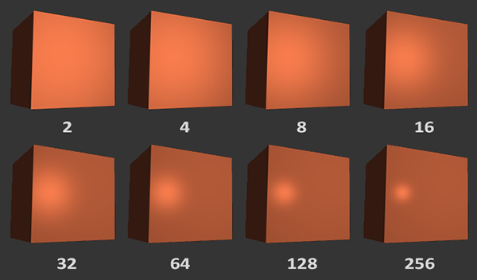
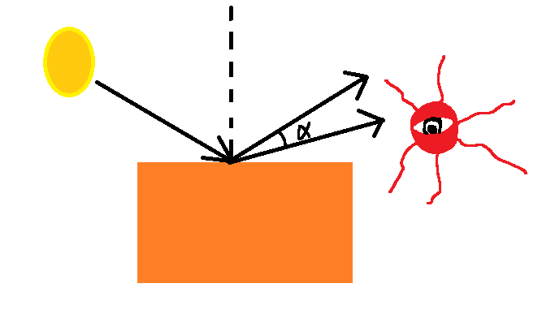

# OpenGL 里的光照

    众所周知，我们看到的物体实际上是物体反射的光进入到了我们的眼睛中，

    而物体会从光中吸收一部分颜色，剩下的才会反射到我们的眼睛里来，

    所以我们看到的物体的颜色既和它本身有关，也和光的颜色有关。

    OpenGL 中用 RGBA 的模型来表示颜色，将 0 ~ 255 的值换算成 0.0f ~ 1.0f，

    将物体的 RGB 和 光的 RGB 相乘，即可得到它们应该展现在我们眼睛里的颜色。

# 基础光照

    现实生活中的光照是十分复杂的，受限于我们的计算能力，无法完全模拟，

    于是乎我们会用到一个简化的模型： 冯氏光照模型

    冯氏光照模型用三个光照分量来模拟光照：

        · 环境光照

        · 漫反射光照

        · 镜面光照

    三者对物体的亮度都会做出贡献，所以我们只需算出他们最后加在一起即可，

    接下来让我们逐个来介绍他们吧。

## 环境光照 (ambient)

    在现实生活中，由于空气中的尘埃使光不断反射，情况十分复杂，

    但它导致的直接结果就是：无论光是否直接照在物体上，物体总会有一点亮度，

    我们只需要一个很小的常量就能模拟出来这种情况：

```C++
void main()
{
    //光线的环境光照 RGB，乘上物体纹理的 RGB
    vec3 ambient = light.ambient * vec3(texture(material.diffuse, TexCoords));
}
```

## 漫反射光照 (diffuse)

    物体会将照射上来的光线向四面八方反射，所以物体正对着光的那一面我们在任何方向都可以看见，

    这个模型中我们只需要考虑 光源位置 和 物体的片段的位置 计算这个光线的方向向量，

    并用该 方向向量 和 物体表面的法向量 点乘的方法来计算光线照在物体上的夹角的余弦值。

    角度越大，余弦值越小，算出的漫反射光照对物体亮度的贡献值越小，

    正对时，其贡献值最大; 0 ~ 90° 时其贡献值慢慢减小，直到大于 90° 时应当就无贡献了。

```C++
void main()
{
    //计算光线方向向量并将其标准化
    //由于我们需要计算出一个锐角，所以这个光线是由物体指向光源的
    vec3 lightDir = normalize(light.position - fragPos);

    //计算夹角，为了防止余弦值小于 0，我们将其和 0.0 比较获取二者中的最大值
    float diff = max(dot(normal, lightDir), 0.0);

    //光照的漫反射光照 RGB 乘上 角度的余弦值 乘上 物体纹理的 RGB 得到其贡献值
    vec3 diffuse = light.diffuse * diff * vec3(texture(material.diffuse, TexCoords));
}
```

## 镜面光照 (specular)

    正对一块镜子打开你的手电筒时，我想你会看到手电筒的光直接反射到你的眼睛中，

    而你看到的在镜子上形成的一大块高光区域，便是镜面光照。

    在这个模型里，镜面光照不仅和 光照射到物体上的方向 有关，也和 我们观察的位置 有关，

    在这里，我们计算 反射光向量 和 观察向量 的夹角 α 的余弦值，即可得出高光亮度大小，

    可以看到，观察向量 与 反射光向量 夹角越小，余弦值也就越大，这里看上去也就越亮，

    然后，再将这个余弦值经过一定值的次方 (物体的反光度) 后，便能得到高光的边缘亮度迅速下降的效果。



```C++
void main()
{
    //计算由物体指向光源的向量，和漫反射光照共用
    vec3 lightDir = normalize(light.position - fragPos);

    //reflect内置函数接受入射光线向量和法向量的值，并计算出反射光线向量
    //由于lightDir是物体片段指向光源的向量，所以这里我们取反
    vec3 reflectDir = reflect(-lightDir, normal);

    //先是计算出这个余弦值，再将其次方
    float spec = pow(max(dot(viewDir, reflectDir), 0.0), material.shininess);

    //光源的镜面光照强度 乘以 计算获得的当前位置强度 乘以 纹理的 RGB 得到镜面光照的贡献值
    vec3 specular = light.specular * spec * vec3(texture(material.specular, TexCoords));
}
```

    我想，不同的 反光度，效果的差别也是非常大的，以下便是 LearnOpenGL 上的示例图片



    最后，你只需要把这三个光照分量的贡献值加在一起，便能得到 该光源 照射在物体上的最终效果啦，

    在这里，我想我们可以用 ImGui 来即时修改这几个分量的数据，以便能够直观地看到他们对物体产生的影响。

# 投光物

    我们将能发出光的物体分为以下几种

    · 平行光，例如在一般条件下与我们的距离可视为无穷大的太阳发射出来的光，相邻的 光线(虽然不存在) 是平行的。

    · 点光源，例如一颗烟花在半空中爆炸发射出来的光，它射向四面八方。

    · 聚光，例如手电筒发射出来的光，它就像一个以光源位置为顶点的圆锥，只朝一个特定方向覆盖光照。

    你可以知道，其实 聚光 就是 点光源 的一种特殊情况，但在程序里它多了一个角度的概念(描述这个圆锥)，

    那么，让我们来逐个介绍这些投光物吧。