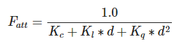
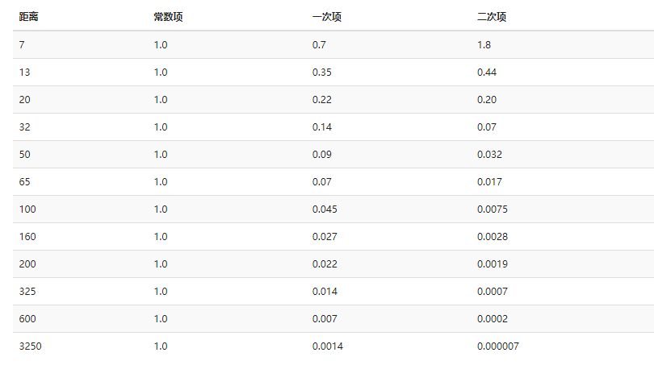
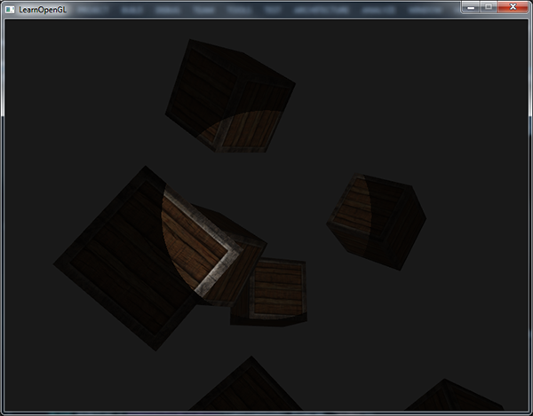
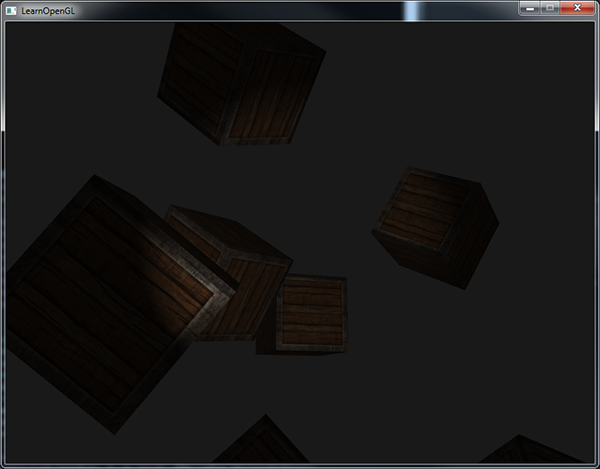
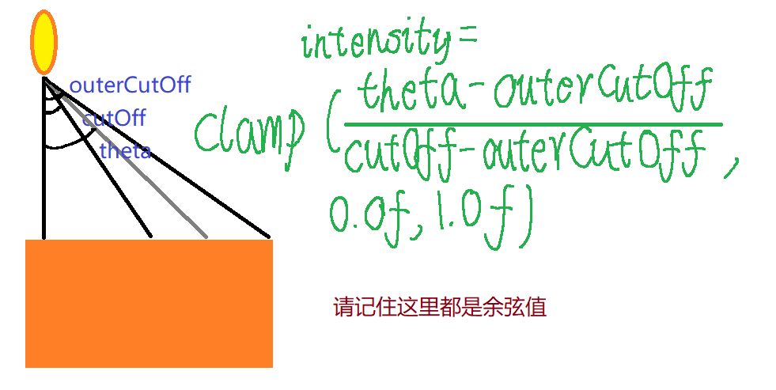

# OpenGL 里的光照

    众所周知，我们看到的物体实际上是物体反射的光进入到了我们的眼睛中，

    而物体会从光中吸收一部分颜色，剩下的才会反射到我们的眼睛里来，

    所以我们看到的物体的颜色既和它本身有关，也和光的颜色有关。

    OpenGL 中用 RGBA 的模型来表示颜色，将 0 ~ 255 的值换算成 0.0f ~ 1.0f，

    将物体的 RGB 和 光的 RGB 相乘，即可得到它们应该展现在我们眼睛里的颜色。

# 基础光照

    现实生活中的光照是十分复杂的，受限于我们的计算能力，无法完全模拟，

    于是乎我们会用到一个简化的模型： 冯氏光照模型

    冯氏光照模型用三个光照分量来模拟光照：

        · 环境光照

        · 漫反射光照

        · 镜面光照

    三者对物体的亮度都会做出贡献，所以我们只需算出他们最后加在一起即可，

    接下来让我们逐个来介绍他们吧。

## 环境光照 (ambient)

    在现实生活中，由于空气中的尘埃使光不断反射，情况十分复杂，

    但它导致的直接结果就是：无论光是否直接照在物体上，物体总会有一点亮度，

    我们只需要一个很小的常量就能模拟出来这种情况：

```C++
void main()
{
    //光线的环境光照 RGB，乘上物体纹理的 RGB
    vec3 ambient = light.ambient * vec3(texture(material.diffuse, TexCoords));
}
```

## 漫反射光照 (diffuse)

    物体会将照射上来的光线向四面八方反射，所以物体正对着光的那一面我们在任何方向都可以看见，

    这个模型中我们只需要考虑 光源位置 和 物体的片段的位置 计算这个光线的方向向量，

    并用该 方向向量 和 物体表面的法向量 点乘的方法来计算光线照在物体上的夹角的余弦值。

    角度越大，余弦值越小，算出的漫反射光照对物体亮度的贡献值越小，

    正对时，其贡献值最大; 0 ~ 90° 时其贡献值慢慢减小，直到大于 90° 时应当就无贡献了。

```C++
void main()
{
    //计算光线方向向量并将其标准化
    //由于我们需要计算出一个锐角，所以这个光线是由物体指向光源的
    vec3 lightDir = normalize(light.position - fragPos);

    //计算夹角，为了防止余弦值小于 0，我们将其和 0.0 比较获取二者中的最大值
    float diff = max(dot(normal, lightDir), 0.0);

    //光照的漫反射光照 RGB 乘上 角度的余弦值 乘上 物体纹理的 RGB 得到其贡献值
    vec3 diffuse = light.diffuse * diff * vec3(texture(material.diffuse, TexCoords));
}
```

## 镜面光照 (specular)

    正对一块镜子打开你的手电筒时，我想你会看到手电筒的光直接反射到你的眼睛中，

    而你看到的在镜子上形成的一大块高光区域，便是镜面光照。

    在这个模型里，镜面光照不仅和 光照射到物体上的方向 有关，也和 我们观察的位置 有关，

    在这里，我们计算 反射光向量 和 观察向量 的夹角 α 的余弦值，即可得出高光亮度大小，

    可以看到，观察向量 与 反射光向量 夹角越小，余弦值也就越大，这里看上去也就越亮，

    然后，再将这个余弦值经过一定值的次方 (物体的反光度) 后，便能得到高光的边缘亮度迅速下降的效果。


```C++
void main()
{
    //计算由物体指向光源的向量，和漫反射光照共用
    vec3 lightDir = normalize(light.position - fragPos);

    //reflect内置函数接受入射光线向量和法向量的值，并计算出反射光线向量
    //由于lightDir是物体片段指向光源的向量，所以这里我们取反
    vec3 reflectDir = reflect(-lightDir, normal);

    //先是计算出这个余弦值，再将其次方
    float spec = pow(max(dot(viewDir, reflectDir), 0.0), material.shininess);

    //光源的镜面光照强度 乘以 计算获得的当前位置强度 乘以 纹理的 RGB 得到镜面光照的贡献值
    vec3 specular = light.specular * spec * vec3(texture(material.specular, TexCoords));
}
```

    我想，不同的 反光度，效果的差别也是非常大的，以下便是 LearnOpenGL 上的示例图片


    最后，你只需要把这三个光照分量的贡献值加在一起，便能得到 该光源 照射在物体上的最终效果啦，

    在这里，我想我们可以用 ImGui 来即时修改这几个分量的数据，以便能够直观地看到他们对物体产生的影响。

```C++
int main()
{
    // 初始化ImGui 部分，创建上下文
    IMGUI_CHECKVERSION();
    ImGui::CreateContext();
    ImGuiIO& io = ImGui::GetIO(); (void)io;
    // 设置 ImGui 风格
    ImGui::StyleColorsDark();
    // 初始化 ImGui 的 OpenGL 和 GLFW
    ImGui_ImplGlfw_InitForOpenGL(window, true);
    ImGui_ImplOpenGL3_Init("#version 420");

    // ...
    // 声明与光照相关的变量
    float shininess = 32.0f;
    ImVec4 dirColor = ImVec4(1.0f, 1.0f, 1.0f, 1.0f);
    float dirSpecularStrength = 0.5f;
    float dirDiffuseStrength = 0.4f;
    float dirAmbientStrength = 0.05f;
    // ...

    while (!glfwWindowShouldClose(window))
    {
        //...
        // 初始化 ImGui 当前帧
        ImGui_ImplOpenGL3_NewFrame();
        ImGui_ImplGlfw_NewFrame();
        ImGui::NewFrame();
        
        // 创建一个交互界面，名字为"Set the data"
        ImGui::Begin("Set the data");

        // 滑条控件，第三和第四个参数为界定值，
        // 请记住多个控件的第一个参数不能够相同，否则修改时会一起变
        ImGui::SliderFloat("shininess", &shininess, 4.0f, 256.0f);

        // 颜色控件，专门用于修改 RGB 颜色值
        ImGui::ColorEdit3("DirColor", (float*)&dirColor);
        ImGui::SliderFloat("dirAmbientStrength", &dirAmbientStrength, 0.0f, 1.0f);
        ImGui::SliderFloat("dirDiffuseStrength", &dirDiffuseStrength, 0.0f, 1.0f);
        ImGui::SliderFloat("dirSpecularStrength", &dirSpecularStrength, 0.0f, 1.0f);

        ImGui::End();

        // 向 Shader 中的 uniform 变量传入值，我们一个个传入即可
        ourShader.use();
        ourShader.setVec3("viewPos", camera.Position);
        ourShader.setFloat("material.shininess", shininess);

        ourShader.setVec3("dirLight.direction", -0.2f, -1.0f, -0.3f);
        ourShader.setVec3("dirLight.ambient", dirColor.x * dirAmbientStrength,
            dirColor.y * dirAmbientStrength, dirColor.z * dirAmbientStrength);

        ourShader.setVec3("dirLight.diffuse", dirColor.x * dirDiffuseStrength,
            dirColor.y * dirDiffuseStrength, dirColor.z * dirDiffuseStrength);

        ourShader.setVec3("dirLight.specular", dirColor.x * dirSpecularStrength,
            dirColor.y * dirSpecularStrength, dirColor.z * dirSpecularStrength);

        //...
    }

    //...
}
```

# 投光物

    我们将能发出光的物体分为以下几种：

    · 平行光，例如在一般条件下与我们的距离可视为无穷大的太阳发射出来的光，相邻的 光线(虽然不存在) 是平行的。

    · 点光源，例如一颗烟花在半空中爆炸发射出来的光，它射向四面八方。

    · 聚光，例如手电筒发射出来的光，它就像一个以光源位置为顶点的圆锥，只朝一个特定方向覆盖光照。

    你可以知道，其实 聚光 就是 点光源 的一种特殊情况，但在程序里它多了一个角度的概念(描述这个圆锥)，

    而且他们都会有 环境光照、漫反射光照、镜面光照，

    但在一般情况下，点光源的环境光照非常小，聚光的环境光照更是小到忽略不计，且除了平行光以外，
    
    其他的光源的光照分量应当都随着距离而衰减 (想想作为平行光源的太阳和作为聚光的台灯你就知道为什么了)。

    场景中如果有很多这种光源的话，我们先算出他们三种 光照分量 的贡献值加在一起后，

    再把他们的 总贡献值 全部加在一起，算出所有光源对物体 RGB值 的影响。

    那么，让我们来逐个介绍这些投光物吧。

## 平行光

    在 GLSL 中，我们用一个结构体来表示它，除了上面提到的三种光照分量外，我们还需要一个 direction 来表示光线照射过来的方向。

```C++
struct DirLight {
    vec3 direction;
	
    vec3 ambient;
    vec3 diffuse;
    vec3 specular;
};

uniform DirLight dirLight;

vec3 CalcDirLight(DirLight light, vec3 normal, vec3 viewDir);
```
    和 C++ 有够像的 (笑)

    对于 平行光 我们只需要这些即可，用 uniform 变量让外部为这个光照传值，
    
    而单独声明一个函数用于计算在这个光照的影响下，物体呈现的颜色。

```C++
vec3 CalcDirLight(DirLight light, vec3 normal, vec3 viewDir)
{
    vec3 lightDir = normalize(-light.direction);
    // 漫反射光照分量
    float diff = max(dot(normal, lightDir), 0.0);
    // 镜面反射光照分量
    vec3 reflectDir = reflect(-lightDir, normal);
    float spec = pow(max(dot(viewDir, reflectDir), 0.0), material.shininess);
    // 将这些结果加在一起
    vec3 ambient = light.ambient * vec3(texture(material.diffuse, TexCoords));
    vec3 diffuse = light.diffuse * diff * vec3(texture(material.diffuse, TexCoords));
    vec3 specular = light.specular * spec * vec3(texture(material.specular, TexCoords));

    return (ambient + diffuse + specular);
}
```

## 点光源

    对于点光源，由于它朝所有方向发出光照，所以我们只需要一个位置描述它即可，

    但在这里，由于我们还需要模拟衰减的效果，所以我们还需要三个 衰减方程 的系数，
    
    这个方程是这样的：




```C++
struct PointLight {
    vec3 position;
    
    float constant;
    float linear;
    float quadratic;
	
    vec3 ambient;
    vec3 diffuse;
    vec3 specular;
};

uniform PointLight pointlight;

vec3 CalcPointLight(PointLight light, vec3 normal, vec3 fragPos, vec3 viewDir);
```

    这三个系数的值不同，光照覆盖的范围和衰减程度也不同，但是有以下几个注意事项：

        · 常量值用于保证方程的分母不会小于 1，否则某些距离的光照不但不衰减反倒增强

        · 一次项系数用于让方程的光照强度线性减少，模拟在近处的衰减，一般很小

        · 二次项系数用于模拟在远处光照强度的变化，也就是急速减少，一般系数比一次项要更小

    下面笔者从 LearnOpenGL 上复制了三个数据下来作为参考，当然还有更多数据。



    在 GLSL 中实现时，我们使用 length内置函数 来计算两点的距离用于方程即可。

```C++
vec3 CalcPointLight(PointLight light, vec3 normal, vec3 fragPos, vec3 viewDir)
{
    vec3 lightDir = normalize(light.position - fragPos);
    
    float diff = max(dot(normal, lightDir), 0.0);

    vec3 reflectDir = reflect(-lightDir, normal);
    float spec = pow(max(dot(viewDir, reflectDir), 0.0), material.shininess);
    // 计算光照强度衰减方程
    float distance = length(light.position - fragPos);
    float attenuation = 1.0 / (light.constant + light.linear * distance + light.quadratic * (distance * distance));

    vec3 ambient = light.ambient * vec3(texture(material.diffuse, TexCoords));
    vec3 diffuse = light.diffuse * diff * vec3(texture(material.diffuse, TexCoords));
    vec3 specular = light.specular * spec * vec3(texture(material.specular, TexCoords));
    // 让三个光照分量分别乘上这个值模拟衰减效果
    ambient *= attenuation;
    diffuse *= attenuation;
    specular *= attenuation;

    return (ambient + diffuse + specular);
}
```

## 聚光

    对于 聚光 来说，想象一下手电筒就可以了，它只会照亮它 当前位置的 前面一片范围的 物体，

    所以它不仅有 position 来描述位置，还有 direction 来描述它朝向的方向，
    
    更有角度值 cutOff 来描述它照亮的范围大小，

    而且这个角度值是两个，一个内圈 cutOff 和一个外圈 outerCutOff，
    
    所有落在内圈的物体片段接收到的光照强度贡献值是相同的，
    
    而内圈到外圈这个范围 光照强度贡献值 会慢慢的减少。

```C++
struct SpotLight {
    vec3 position;
    vec3 direction;
    float cutOff;
    float outerCutOff;
  
    float constant;
    float linear;
    float quadratic;
  
    vec3 ambient;
    vec3 diffuse;
    vec3 specular;
};

uniform spotlight SpotLight;

vec3 CalcSpotLight(SpotLight light, vec3 normal, vec3 fragPos, vec3 viewDir);
```

    这是只有内圈时聚光的效果，它会显得十分假，因为它的有一圈硬边，没有平滑过渡的效果：



    而加上外圈实现了平滑过渡后，它看上去会是这样的：



    这样子看上去就真实太多了 (笑)，

    接下来让我们来看看它们是如何实现的吧。

```C++
vec3 CalcSpotLight(SpotLight light, vec3 normal, vec3 fragPos, vec3 viewDir)
{
    vec3 lightDir = normalize(light.position - fragPos);

    float diff = max(dot(normal, lightDir), 0.0);

    vec3 reflectDir = reflect(-lightDir, normal);
    float spec = pow(max(dot(viewDir, reflectDir), 0.0), material.shininess);

    float distance = length(light.position - fragPos);
    float attenuation = 1.0 / (light.constant + light.linear * distance + light.quadratic * (distance * distance));

    // 聚光强度
    float theta = dot(lightDir, normalize(-light.direction)); 
    float epsilon = light.cutOff - light.outerCutOff;
    float intensity = clamp((theta - light.outerCutOff) / epsilon, 0.0, 1.0);

    vec3 ambient = light.ambient * vec3(texture(material.diffuse, TexCoords));
    vec3 diffuse = light.diffuse * diff * vec3(texture(material.diffuse, TexCoords));
    vec3 specular = light.specular * spec * vec3(texture(material.specular, TexCoords));

    ambient *= attenuation * intensity;
    diffuse *= attenuation * intensity;
    specular *= attenuation * intensity;

    return (ambient + diffuse + specular);
}
```
    这个边缘平滑方程长这个样子：



    注意到，我们用了三个变量，theta 是 光源正对的方向向量 和 光源到物体上某一片段的方向向量 的夹角的余弦值，

    接下来是 epsilon，这个分母便是 内圈余弦值 减去 外圈余弦值，用前者除去它便能得到平滑的强度值，

    注意到，我们使用了 clamp() 内置函数，用于限制这个值在 0.0 ~ 1.0f 之间，

    所以，在内圈的值大于 1 最后会等于 1，所以聚光对内圈的光照强度贡献值都一样，

    而大于外圈的所有值小于 0 最后会等于 0，聚光对他们就没有了贡献值。

    接下来，让三个光照分量在乘上 衰减量 时再乘上 边缘平滑值，我们便能得到那个比较真实的效果。

    最后，我们只需要让物体片段加上所有光源对它的贡献值即可，

    在 LearnOpenGL 里面是一个平行光，四个点光源，以及摄像机正前方的聚光：

```C++
void main()
{    
    // 标准化法向量
    vec3 norm = normalize(Normal);
    // 标准化摄像机观察向量
    vec3 viewDir = normalize(viewPos - FragPos);
    // 算出平行光的贡献值
    vec3 result = CalcDirLight(dirLight, norm, viewDir);
    // 算出 4 个点光源的贡献值
    for(int i = 0; i < NR_POINT_LIGHTS; i++)
        result += CalcPointLight(pointLights[i], norm, FragPos, viewDir);    
    // 算出摄像机正前方的聚光的贡献值
    result += CalcSpotLight(spotLight, norm, FragPos, viewDir);
    
    // 计算完毕并输出
    FragColor = vec4(result, 1.0);
}
```

> ---by hsz 2021.10.10