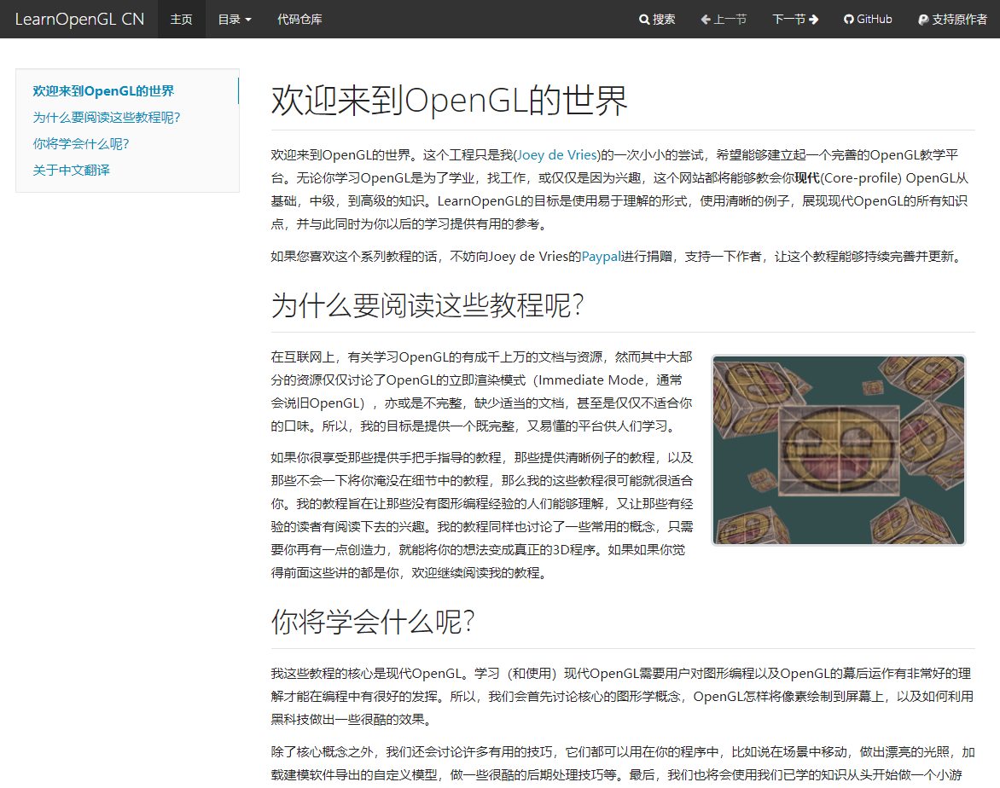

# OpenGL 是什么，为什么要学习这种底层的知识?

OpenGL 一般被认为是一套操作图形和图像的 API，然而它其实只是一套规范，

而功能一般由各显卡生产商开发，当然，如果是 Linux，也不乏爱好者改编的版本。

而我学习 OpenGL 的原因则是想要深入了解计算机图形的工作原理，

以丰富我的知识写出功能更强大更齐全的游戏引擎。

# ImGui 是什么，为什么要用 ImGui?

Gui 很好理解，Graphic User Interface 嘛，第一次看到这个名字的时候我还以为是 I'm GUI（笑）

后来才知道 `ImGui` 的全称为 Immediate mode Gui，译作` 即时渲染图形用户界面`，

也因为这个名称是个统称，是作者开始想不到用什么名字的时候用的，于是乎现在改名为了 `dear-imgui`（Oh, dear! I'm GUI!)

至于我为什么要去研究这个嘛...主要是因为自研游戏引擎需要一个图形交互界面提高开发效率，

而且 `qt` 和 `wpf` 对于初入茅庐的我过于庞大，所以我就选择了相对来说比较小巧的 `ImGui`，

而且正好可以配合 OpenGL 一起使用，给我的学习提供了大量的便利。

如果游戏引擎有了可视化交互界面，开发效率会大大提升的，我想。

# 如何学习这两部分知识?

这两部分知识可以结合起来学习，OpenGL 用于渲染场景中的图形，而 ImGui 用于即时修改他们的数据。

OpenGL 的知识我主要通过 [LearnOpenGL](https://learnopengl-cn.github.io/) 来学习，受限于我目前的英语水平，我只敢看中文版的...

[ImGui](https://github.com/ocornut/imgui) 目前在网上的教程和文档都比较少(官方的说明也很少)，所以我选择直接查看它的示例程序学习。

接下来，欢迎来到 ImGui & OpenGL 的世界!

> -- by hsz 2021.10.10