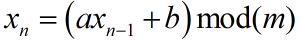

# 伪随机数

最近正在制作一个纵版沙盒游戏，于是乎需要一种根据种子生成地图的算法，而这刚好和伪随机数算法的原理十分相似，于是乎在这里学习并整理伪随机数的笔记。

## 一、随机数的分类

+ 真随机数：只能通过某些随机的物理过程产生，不可能产生两个相同的真随机数序列。
+ 准随机数：不具备随机性质，仅仅是用它来处理问题能够得到正确的结果。
+ 伪随机数：通过某种数学公式或算法产生的数值序列，能通过统计检验的便可当成真随机数使用。

## 二、伪随机数算法

一般来说基本思想为 `均匀分布`，常用 `线性同余法` 或 `乘同余法`。

用于产生这种均匀型伪随机数的线性同余产生器的方程为

可以看到，这个产生器是一个递推的，它需要一个初始值 x0 作为种子，递推出后面的随机数

也就是说如果种子值是一样的话，产生的随机数序列就是一样的，所以一般用系统时间来作为种子，

当然，如果做随机生成地图的话，我们就可以将这个数保留下来，作为下一次继续产生这个世界的种子。

参数有以下几个要求，会让产生器的效果更好：

+ a = 4p + 1，b = 2q + 1，且其值越大越均匀
+ m 最好较大，其值直接影响序列的周期长短
+ a 和 m 互质